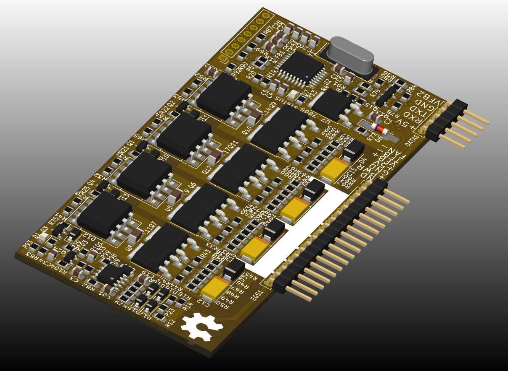
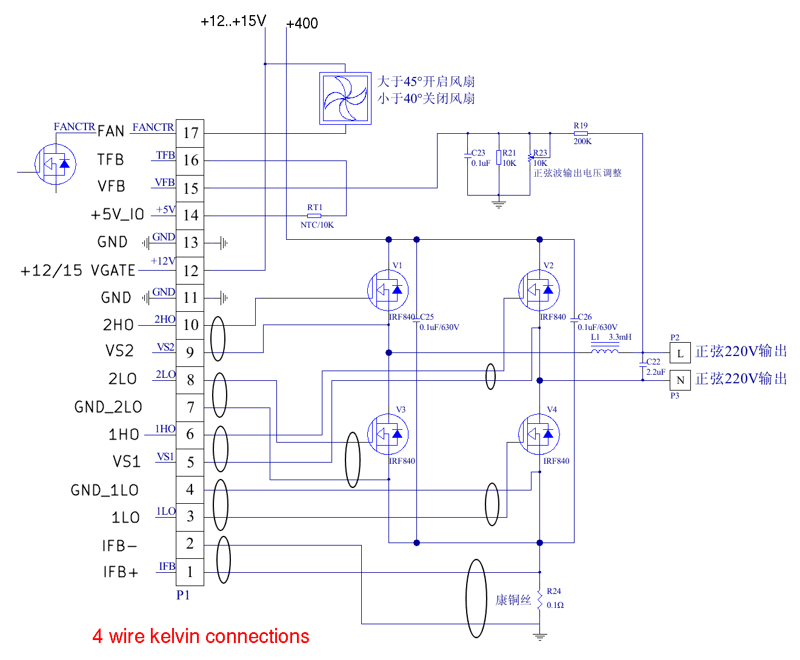

# EG8010
Collection of designs for the EG8010 (ASIC for single-phase SPWM control H-bridge)

# EG8010_A0
EG8010_A0 is the inverter version to replace EGS002. Uses TLP250 optical isolated drivers and a Totem-pole current amplifier to drive high gate capacitance MOSFET transistors. A four-pin Kelvin circuit is used for all connections.

The connection diagram has a minimum of parts. An external +5V power supply is not required if the 7805 is populated on board. The fan is controlled directly from the printed circuit board. Twisted wires are indicated by ovals. Please don't separate them.

# MIT License
Design is distributed under the terms of the MIT license.

You can use this project for personal and business.
You can make it and sell it.
You may modify this project as you see fit.
You are bound by the copyright.

NO WARRANTIES of any kind are given!

All actions are at your OWN RISK!

Copyright (c) 2023, Sergey Kostyanoy <contact@arduino.uno>
